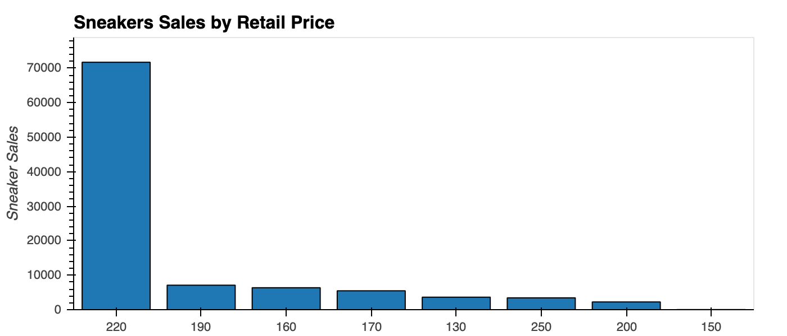
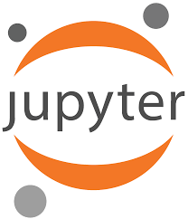

## DApp Summary

This application is a decentralized collectible sneaker auction platform built on Ethereum

## Demo App

Click [here](https://githb21.github.io/auction_dapp) to launch the dapp

---
## Table of Contents

* [About](#About)
* [Initial Coin Offering (ICO)](#initial-coin-offering-(ICO)) 
* [Auction](#auction) 
* [Market Analysis and Modeling](#market-analysis-and-modeling) 
* [Development Platforms](#development-platforms)
* [Collaborators](#collaborators)
* [Resources](#resources)

---
## About

CryptoSneaks is a decentralized auction platform for collectible sneakers, which enables a transparent, real-time bidding process for buyers who are interested in collectible sneakers. CryptoSneaks (the admin) will be able to register new sneakers with their account, minting and creating a new auction for the sneaker. When the endAuction function is called, the auction will complete and the token will be transferred to the highest bidder. Each collectible sneaker will be a unique ERC721 token, with its own metadata including the name, size and image URL, to be registered on [Pinata](https://pinata.cloud/) - a decentralized InterPlanetary File System.

In order to fund the development of CryptoSneaks, an Initial Coin Offering was created. We have also used Machine Learning to analyze the sneaker resale markets data which provides valuable market intel for investors of collectible markets.

---
## Initial Coin Offering (ICO)

### Deplopy the crowdsale


### Purchase AUC token


### Finalize sale


You can view the AUC token on Ropsten testnet Etherscan by inputting the token_address


---
## Auction

### Register the sneaker (only admin - contract deployer has the rights)


Registered shoes metadata can be found on [Pinata](https://pinata.cloud/)


### Bid


### End auction (only admin - contract deployer has the rights)


You can view all the transaction detals on Ropsten testnet Etherscan by inputting the contract address


---
## Market Analysis and Modeling
Using the dataset provide by StockX we evaluated the different aspects of the sneakers resale market and develop a regression model to predict resale price identify the most relevant features of the sneakers market. 





### Parameters
```python
# Define features set
X = df.drop(['sale_price'], axis=1)

# Define target vector
y = df.sale_price

# Encoding variables
X = pd.get_dummies(X, columns=["brand", "sneaker_name", "buyer_region"])
X.head()

# Splitting into Train and Test sets
X_train, X_test, y_train, y_test = train_test_split(X, y, test_size=0.2, random_state = 27)

# Create the random forest regresor instance
rf_model = RandomForestRegressor(n_estimators=500,random_state=27)
```

### Results
```python
R²: 0.98
Mean Absolute Error: 14.49
Median Absolute Error: 7.10
Accuracy: 97.14%
```


---
## Development Platforms





---
## Collaborators
- Sylvia Li
- Emmanuel Lopez 
- Etienne Alcaraz

---
## Resources
- [Random Forest Regression](MarketAnalysis/notebooks/Random_Forest_Regression.ipynb)
- [Sneakers Analysis](MarketAnalysis/notebooks/Sneakers_Data_Analysis.ipynb)
- [ICO Crowdsale Smart Contract](ICO/AuctionCoinCrowdSale.sol)
- [Auction Smart Contract](auction/KickMarket.sol)
- [StockX Data Contest](https://stockx.com/news/the-2019-data-contest/)